iCare2 è un’applicazione per il monitoraggio della salute che permette di controllare lo stato dei propri valori corporei e avvisarti qualora uno di essi non rientri
nell’intervallo da te stabilito. La funzione principale consiste nell’inserimento di un report con i propri valori corporei lasciando all’app il compito di ricordarti
di inserirlo giornalmente.

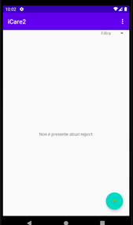 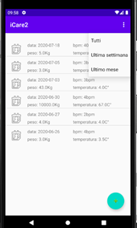 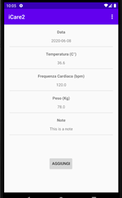

                    
<h1>Funzionamento</h1>

**Preferenze:** 
all’apertura dell’applicazione si viene portati nel menu delle preferenze dove bisogna scegliere la priorità di ogni valore corporeo,l’intervallo che la media dei valori
non deve superare e il periodo nel quale si vuole controllare la media dei valori. Questo menu viene mostrato alla prima apertura e si può accederci andando nelle preferenze.

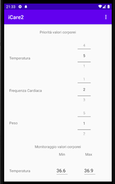 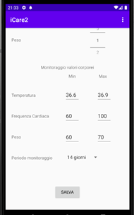
                                       
La priorità del valore corporeo è un valore da 1 a 5 e viene usato per l’invio della notifica nel caso in cui uno dei valori non rientri nell’intervallo prestabilito.
Se la priorità è minore di 3 la notifica non viene inviata anche se il valore medio nel periodo di monitoraggio supera l’intervallo scelto. 
All’apertura l’app compila con dei valori predefiniti l’intervallo da non superare ma è possibile ometterlo lasciando il campo vuoto, in tal casola notifica non verrà 
mai inviata anche se l’importanza è maggiore di 3. 

**Home:**
dopo aver salvato le preferenze si viene portati sulla home dove sarà mostrata la lista dei report dal più recente a quello meno recente. È possibile inserire il report 
cliccando sull’icona in basso a destra. 
Sulla action bar è presente il tasto che apre un menu a tendina contenente: Preferenze, Scelta orario di notifiche, Grafici. È inoltre presente un filtro per mostrare i 
report in base al loro periodo di aggiunta.

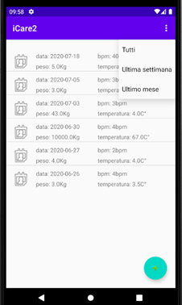 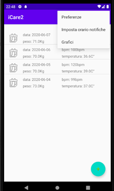

                          
Cliccando su un report sono possibili due conseguenze:

-si apre la nota aggiunta per quel report (se non è presente alcuna nota un messaggio lo comunica).

-si viene portati in un’altra pagina con la lista di report aggiunti in quel giorno (nel caso in cui quel giorno vi sia più di un report)

I valori corporei mostrati nella home sono frutto della media giornaliera nel caso in cui siano presenti più report nello stesso giorno.

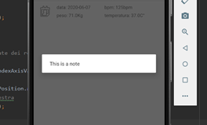 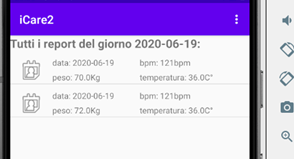

Facendo invece click lungo su un report si ha la possibilità di scegliere tra due opzioni:

-modificarlo (in tal caso si aprirà un form dove è possibile farlo)

-eliminarlo (sarà chiesta una conferma)

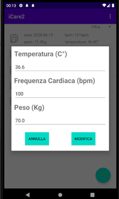
                                                               

**Aggiungi report:** cliccando sul tasto per aggiungere il report viene aperta una pagina per compilare i valori corporei. L’aggiunta della nota è facoltativa, mentre tutti
gli altri campi devono essere messi per poter proseguire. 

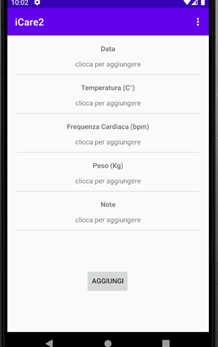 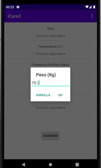
                               
Premendo “Aggiungi” il report viene aggiunto e si ritorna alla home. 

**Menu:**
 contiene tre opzioni
 
-Preferenze (di cui abbiamo parlato all’inizio)

-Scegli orario di notifica

-Grafici

Per scegliere l’orario di notifica viene aperto un TimePicker che consente di scegliere l’orario in cui si vuole essere ricordati di aggiungere il report. Scegliendo un determinato orario, l’app ripete la notifica ogni giorno all’orario scelto. 

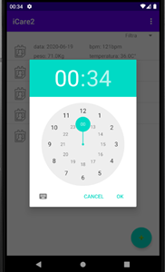                                                                

**Grafici:**
La finestra contenente i grafici si occupa di raccogliere i dati dei report presenti e mostrarli all’utente.
Sono presenti tre quattro grafici, tre per ogni valore corporeo e uno per il numero dei report giornalieri.
I dati riguardano i report dell’ultima settimana, quelli più vecchi non vengono mostrati nei grafici.   

 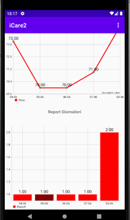
                                   

